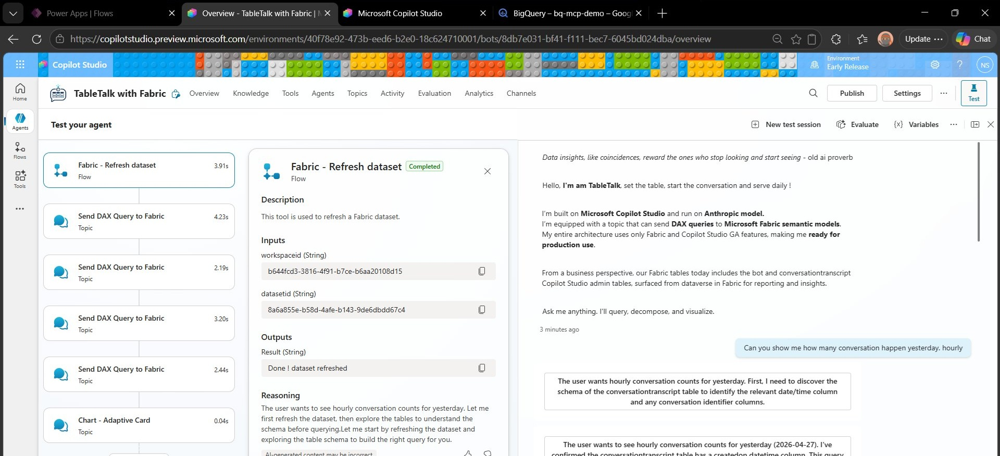
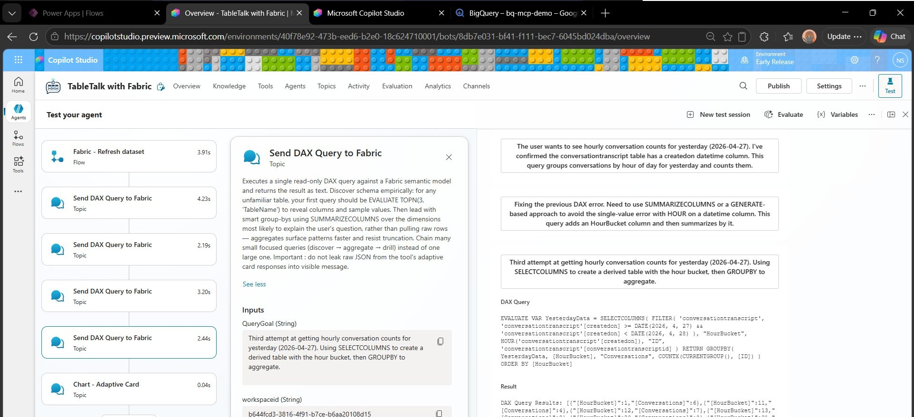
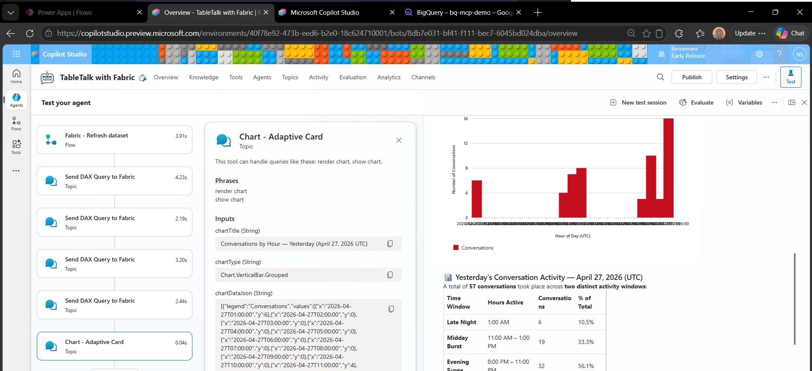
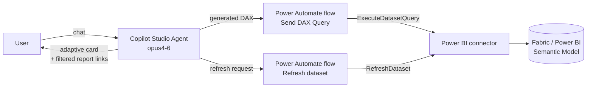

# TableTalk with Fabric 📊

> *Set the table, start the conversation, serve daily.*

**A Copilot Studio agent that thinks like a data analyst — generates DAX, queries your Fabric semantic model, and shows its reasoning along the way.**

TableTalk writes real DAX queries, runs them against a Power BI / Fabric semantic model, charts the results, and tells you *why* it asked what it asked.

---

## 🪶 Copilot Studio : Own your AI. Own your orchestration. Secure and Low friction.

Your tenant. Your data. Your permissions. Your agent. TableTalk is designed to be easy to deploy, and yours end-to-end.

- ✅ **Production-ready — every component is GA.** Copilot Studio, Power BI connector, Agent Flow (Power Automate), adaptive cards. **No preview features** — you can deploy to production next week.
- ✅ **Only the standard Power BI connector**
- ✅ **No Dataverse tables, no custom code, no plugins**
- ✅ **Zero-copy data** — queries hit your semantic model **live**. Nothing is duplicated, embedded, or chunked into a side store.
- ✅ **No async RAG to deploy or maintain** — no vector database, no embedding pipeline, no re-index when data changes. Your model stays the single source of truth, and freshness is whatever Power BI's freshness is.
- ✅ **No service principals or shared secrets** — the flows run as the **invoker** (the signed-in user), so every query inherits that user's Power BI permissions
- ✅ **No data leaves your tenant** — the agent talks to Power BI, period

**All you need:**
1. A Power Platform environment with **Copilot Studio** enabled
2. **Anthropic models** in Copilot Studio
3. The **Power BI connector**
4. **A Fabric semantic model** the user has at least *Build* permission on

---

## ✨ What it actually does

TableTalk wraps four capabilities behind a chat UI:

### 1. 🧠 Generate & execute DAX (the headline)
The agent breaks complex questions into a chain of focused DAX queries. Its system prompt encodes a real analyst workflow:

- **Discover** — for any unfamiliar table, run `EVALUATE TOPN(3, 'TableName')` first to see columns and sample values
- **Aggregate** — lead with `SUMMARIZECOLUMNS` over the dimensions most likely to answer the question (resists row-cap truncation)
- **Drill** — chain many small focused queries instead of one giant one
- **Simplify** — use `DEFINE` blocks where helpful

Each query is executed by a Power Automate flow that calls the Power BI connector's `ExecuteDatasetQuery` action and returns the first **100 rows or 30,000 characters** (whichever comes first), with try/success/failure scopes for clean error handling.

### 2. 🔄 Refresh datasets on demand
Before answering, the agent can trigger a dataset refresh via the Power BI connector's `RefreshDataset` action — handy when the underlying data changes during the conversation.

### 3. 📈 Charts + transparent reasoning
- **Charts**: a built-in topic renders results as adaptive-card charts with multi-series support.
- **QueryGoal**: every DAX query is paired with a 2–4 sentence "QueryGoal" — the agent's own restatement of the user's overarching goal, what it has learned, what this specific sub-query answers, and what the result will tell it next. Shown in a **collapsible adaptive card** so curious users can see the reasoning, but it stays out of the way otherwise.
- **Follow-up suggestions**: every answer ends with a list of questions a curious user would ask next.

### 4. 🔗 Click-through to Power BI (filtered to chat context)
Register a Power BI report that's connected to your semantic model, and the agent will offer **deep links pre-filtered to match the current conversation**. Ask *"why did sales drop for Acme in March?"* — the answer can include a link that opens your Power BI report **already filtered to Acme + March**, ready for deeper exploration in the actual BI tool.

Under the hood: the agent constructs a URL with Power BI's `?filter=` query parameter (OData syntax, URL-encoded spaces and quotes) so the markdown link renders cleanly. Purely client-side — no extra connector or flow involved.

```
https://app.fabric.microsoft.com/groups/me/reports/<REPORT_ID>/<PAGE_ID>?filter=<Table>/<Column>%20eq%20%27<value>%27
```

To enable: paste your report's base URL into the agent's `# Fabric #` instructions block and tell it which fields are filterable (e.g. *"filter on `bot/name`"*). The example currently shipped points at the author's Copilot-logs report — swap it for yours.

This is the bridge that keeps Power BI as the place for deep analysis: the agent answers the *why*, then drops the user into the report with the right filters already applied.

---

## 👀 See it in action

A real walkthrough using TableTalk against the **Copilot Studio admin tables** (bot + conversationtranscript) surfaced in Fabric. The user asks a single question — *"Can you show me how many conversation happen yesterday, hourly"* — and the agent does the rest.

### Step 1 — Greeting & dataset refresh
The agent introduces itself with the production-ready pitch baked into its persona, then **refreshes the dataset first** so the answer reflects the latest data. The left pane shows the `Refresh dataset` tool completing in ~4 seconds.



### Step 2 — Discover → aggregate → self-correct (the QueryGoal in action)
This is where the analyst workflow shows up. The agent narrates each step in plain English, and **when a DAX query fails, it diagnoses and retries** — here it hits a `HOUR()` single-value error, then rewrites the query using `SELECTCOLUMNS` + `GROUPBY` on the third attempt. Each attempt's QueryGoal explains exactly what it's trying and why.



### Step 3 — Chart + summary, ready to share
Once the DAX works, the agent renders a vertical-bar chart via the adaptive-card chart topic and follows up with a structured summary table — *Late Night / Midday Burst / Evening Surge* — that's already business-ready, not just a raw count.



> 📝 **Total time from question to answer:** about 30 seconds. **Total tools used:** 1 refresh + 3 DAX queries + 1 chart render.

---

## 🧩 How the agent learns your schema

The agent discovers **columns** dynamically — for any table it knows about, it runs `EVALUATE TOPN(3, 'TableName')` and learns the columns + sample values on the fly. **Today, it can't list the tables in your model on its own.**

So you teach the agent about your tables. Two patterns work; the second is what most customers actually ship to production.

### Option A — List tables in the system prompt (fast PoC)
Drop a short list of table names into the agent's instructions:

```
# Tables available in this model
- bot
- conversationtranscript
- customer
- orders
```

No need to list columns — TOPN(3) handles those on first use. A 5-minute change, perfect for a quick demo.

### Option B — A metadata table inside your semantic model (what customers actually ship)
Create a small table in your Fabric model — call it `_metadata` or `_dictionary` — with one row per column you care about:

| TableName | ColumnName | Description | Business rules |
|-----------|-----------|-------------|----------------|
| `orders` | `revenue_cents` | Order revenue, stored in cents | Divide by 100 to display in dollars |
| `customer` | `segment` | Customer tier | Only "Enterprise" and "SMB" are reportable; ignore "Internal" |
| `orders` | `status` | Order status | Only count rows where status = 'Confirmed' |

Then tell the agent in its instructions: *"At the start of every conversation, EVALUATE the `_metadata` table and treat the `Business rules` column as ground truth."*

Think of it as **the README of your dataset, kept inside the dataset itself**. Why customers love this pattern:

- **Business users own it.** Adding a column or rewriting a rule is a Fabric edit — no developer ticket, no agent re-publish, no PR.
- **Domain rules ship with the data.** The agent picks up things like *"always exclude internal customers"* automatically, without anyone explaining it in chat.
- **Zero-copy stays zero-copy.** The metadata lives in the same model as the data — no second store to govern, no drift.
- **Same connector, same auth, same flow.** No app registration, no service principal, no new governance review.

For larger or multi-tenant deployments, this is also where you can encode row-level filter hints, currency conversions, deprecation flags (*"don't use this column anymore — use `revenue_v2`"*), and anything else a business owner wishes the agent would just *know*.

---

## 🏗️ Architecture



Both flows use connection reference `shared_powerbi` and run as the invoker.

### 🧬 Pure agentic — operational instructions live at the tool level

There's no RAG sidecar in this picture. No embedding job, no vector store, no chunked-document index. Data is queried live on every request, so the semantic model is the source of truth and there's nothing extra to deploy or keep in sync.

The other architectural choice worth calling out: **operational guidance is embedded in each tool, not crammed into the agent's system prompt.** The DAX-query tool, for instance, carries its own description of when to use `TOPN(3)` vs. `SUMMARIZECOLUMNS`, how to chain queries, and how to handle truncation. The agent's own prompt stays short and personality-focused — it decides *when* to reach for a tool; the tool tells it *how*.

In practice this means:
- New tools can be added without bloating the system prompt
- Tool guidance is co-located with the tool itself, so they don't drift apart over time
- Each tool is reusable in other agents without dragging context along

---

## 📦 What's in this repo

| File | Purpose |
|------|---------|
| `TableTalkFabric_1_0_0_1.zip` | Unmanaged Copilot Studio solution |
| `README.md` | You're reading it |
| `LICENSE` | Apache 2.0 |

### Solution details
- Display name: **TableTalk with Fabric**
- Unique name: `TableTalkFabric`
- Publisher prefix: `nico`
- Version: **1.0.0.1**
- Type: **Unmanaged**
- Model: **Claude Opus 4.6**

### Components inside the solution
- 1 Copilot Studio agent including:
	- 3 custom topics : Send DAX Query to Fabric, Render Chart (with adaptive card), Reset Conversation
	- 1 tool : Refresh dataset
	- 2 Agent Flows (Power Automate) : Send DAX Query, Refresh dataset

---

## ⚠️ Things you'll need to change

The agent's system prompt currently includes **example references to a specific Copilot-logs workspace** (the author's own). They are non-functional defaults — they exist to show the pattern — but you'll want to replace them with your own values, or delete that section entirely if you don't need it.

Open the agent → **Instructions** and look for the `# Fabric #` block. Update or remove:

| Field | Where to change | Example |
|-------|----------------|---------|
| `workspaceid` | Agent instructions | Your Fabric/Power BI workspace GUID |
| `datasetid` | Agent instructions | The semantic model GUID you want to query |
| Table list / metadata-table reference | Agent instructions | See [How the agent learns your schema](#-how-the-agent-learns-your-schema) |
| Power BI report URL | Agent instructions | Your own report (used for the filtered click-through links — see capability #4) |

You can also pass `workspaceid` / `datasetid` dynamically — the **Send DAX Query** topic accepts both as inputs, so the agent can be steered to different semantic models per conversation.

---

## ✅ Prerequisites

- Power Platform environment with **Copilot Studio** and Anthropic enabled
- A **Power BI / Fabric semantic model** (user needs at least *Build*)
- Solution-creator permission in the target environment

---

## 🚀 Quick start

### 1. Download
Grab `TableTalkFabric_1_0_0_1.zip` from this repo.

### 2. Import
1. [make.powerapps.com](https://make.powerapps.com) → pick your environment
2. **Solutions** → **Import solution** → upload the `.zip`
3. Wait ~1 minute for import to finish

### 3. Wire up the Power BI connection
Open the imported solution and find the connection reference for the Power BI connector. Authenticate with an account that has access to the semantic model you want to query.

### 4. Customize the agent instructions
Open the **TableTalk with Fabric** agent → **Instructions** and:
- Replace the example `workspaceid` / `datasetid` with yours (or remove that block)
- **Teach it your schema** — list your tables, or point it at a metadata table (see [How the agent learns your schema](#-how-the-agent-learns-your-schema))
- Update or remove the Power BI report URL used for click-through links
- Optionally: tweak the analyst-style instructions to match your domain

### 5. Test
Use **Test your agent** and try:
- *"Top 10 \<thing\> by revenue last quarter, as a bar chart"*
- *"Refresh the dataset, then compare this month vs last month"*
- *"Why did sales drop in March?"* → watch the discover → aggregate → drill chain in action, then click the Power BI link the agent offers to dig in further

Click the collapsible card under each answer to see the **QueryGoal** and the actual DAX that ran.

### 6. Publish
Hit **Publish** and surface the agent in Teams, a demo site, M365 Copilot, etc.

---

## 🛠️ Troubleshooting

| Problem | Likely fix |
|---------|------------|
| Agent picks wrong workspace/dataset | The hardcoded IDs in the instructions are still pointing at the original — update them |
| Agent doesn't know what tables exist | Teach it — see [How the agent learns your schema](#-how-the-agent-learns-your-schema) |
| Filtered Power BI link doesn't filter | Check that spaces (`%20`) and single quotes (`%27`) are URL-encoded in the agent's filter string, and that the field name (e.g. `bot/name`) actually exists in the report's semantic model |
| Anthropic Model not available | Ask your Copilot Studio / Power Platform admin team |


---

## 📄 License

Licensed under the [Apache License 2.0](LICENSE). Use it, change it, ship it. No warranty — see the license for details.

---

## 🙋 Questions?

Reach out to **Nico Sprotti**.

*Happy table-talking.* 🎉
